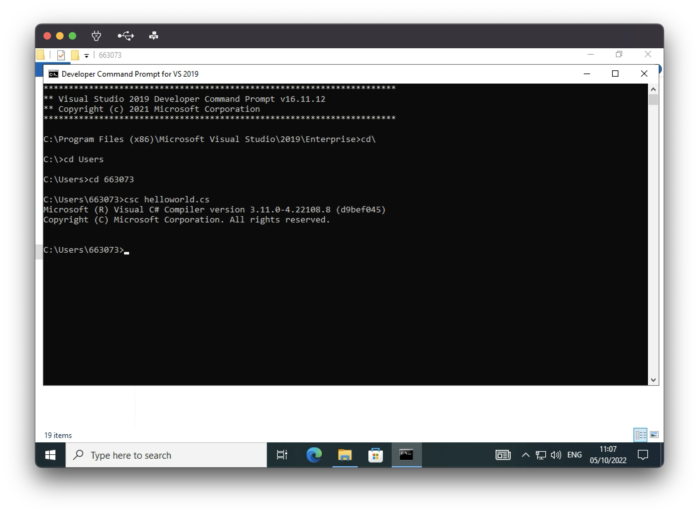
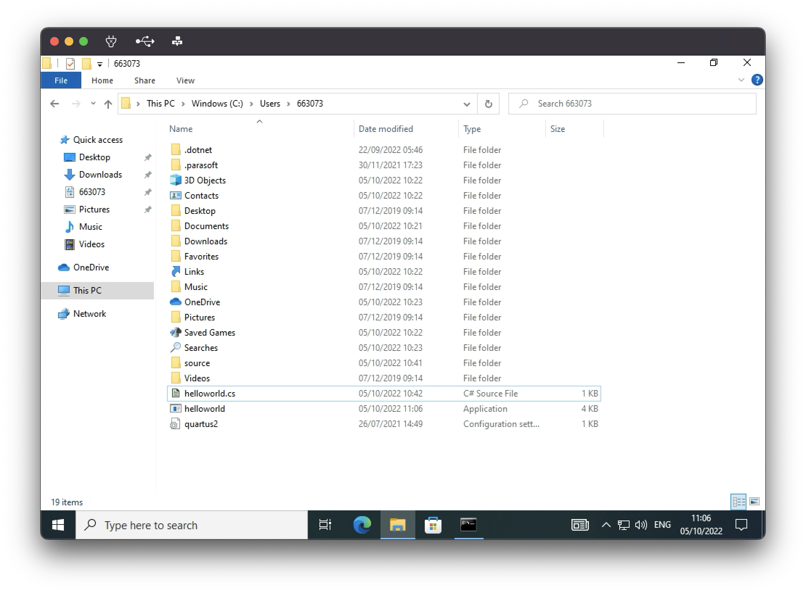

# Formative Assessment 1 - Getting Started

This assessment is formative - which means that you get feedback for completing this, but no marks from this work count towards your final mark for this portfolio. This gives us a little extra time at the start of semester to settle in and try to ensure all our processes are running as smoothly as possible.

## ToDo List

- [ ] [:key: Edit markdown to add headings, tables, bullet lists, check lists, code, images, hyperlinks and emojis](#editing-markdown)
- [ ] [:key: Demonstrate an Understanding of the Compilation Process](#understanding-compilation)
- [ ] [:key: Push changes to Github](#understanding-source-control)
- [ ] [:key: Execute a test plan](executing-a-test-plan)
- [ ] [:speech_balloon: Express new semantics](#semantics)
- [ ] [:thought_balloon: Reflect on what you have learnt](#reflection)
- [ ] [:question: Request feedback (optional)](#requesting-feedback)
- [ ] :white_check_mark: Get your work checked off

## Editing markdown

Here demonstrate that you can add headings, tables, bullet lists, check lists, images, hyperlinks and emojis.

-----------------------------------------------

# this is a heading
- this
- is
- a
- bulletlist
## this is a smaller heading
- [ ] this
- [x] is
- [ ] a
- [x] checklist
### this is a smaller heading

|this|is|a|table|
|---|---|---|---|
|↘️| | |↙️| 
| | these are| emojis| |  
|↗️| | |↖️|

```cs
Console.WriteLine("THIS IS CODE");
```


[check out my soundcloud with this hyperlink](https://soundcloud.com/archiehull)

## Understanding compilation

Here demonstrate your understanding of compilation.

-----------------------------------------------
*As my personal computer is running MacOS, I will run the following exercise of a VM running windows.*

I used a basic "Hello World" program and saved the .cs file on my C drive. I then navigated to the file location in the Developer Command Prompt and used the csc command to compile it into an .exe file.
```cs
using System;
namespace myNamespace
{
    class myClass
    {
          static void Main()
          {
              Console.WriteLine("Hello, World");
          }
    }
}
```



the .cs file can be found [here](F1/helloworld.cs) , and the .exe file can be found [here](F1/helloworld.exe)

## Understanding source control

Here demonstrate your understanding of source control.

## Executing a test plan

|Test Number|Input|Expected Output|Actual Output|Pass/Fail|
|---|---|---|---|---|
| | | | | :x::white_check_mark:|

## Semantics

In order to talk about programming we need to establish a set of core terminology, or "semantics". In this context "semantics" means the words we use to talk about programming. This is different to Syntax, which is what we type to tell the computer what we want it do to. It is important that when we use words that have
a special meaning in the context of programming we share a common understanding.

Complete this table of semantics with your understanding of what these terms mean:

| Word | Synonyms | Meaning |
|---|---|---|
|Source Control| | |
|Commit| | |
|Push| | |
|Compile| | |
|Compile Time| | |
|Syntax Error| | |
|Run Time| | |
|Run Time Error| | |
|Algorithmic Error|Bug :beetle:| |

## Reflection
In this section you should reflect upon what you have learnt. This is an important part of the learning process.
- What have you learnt from these exercises?
- How can you apply what you have learnt?

## Requesting Feedback

This section is optional, but encouraged. Feedback is crucial to the learning process. If you have any questions about what you have learnt this week record them here for your demonstrator to answer. **Replace** the bullet points below with any questions you might have.
- Why are we here?
- What is the meaning of life?
