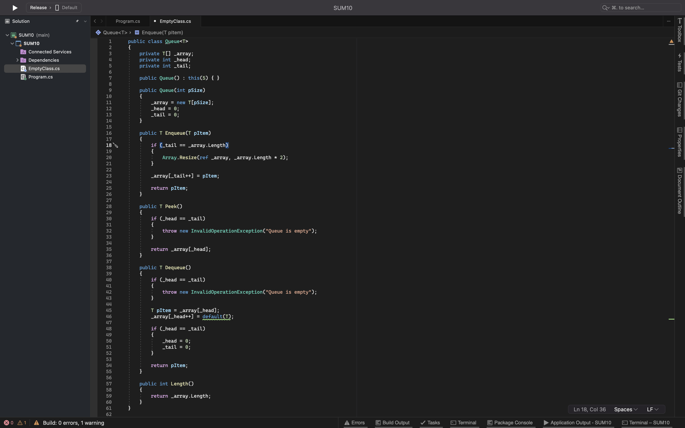
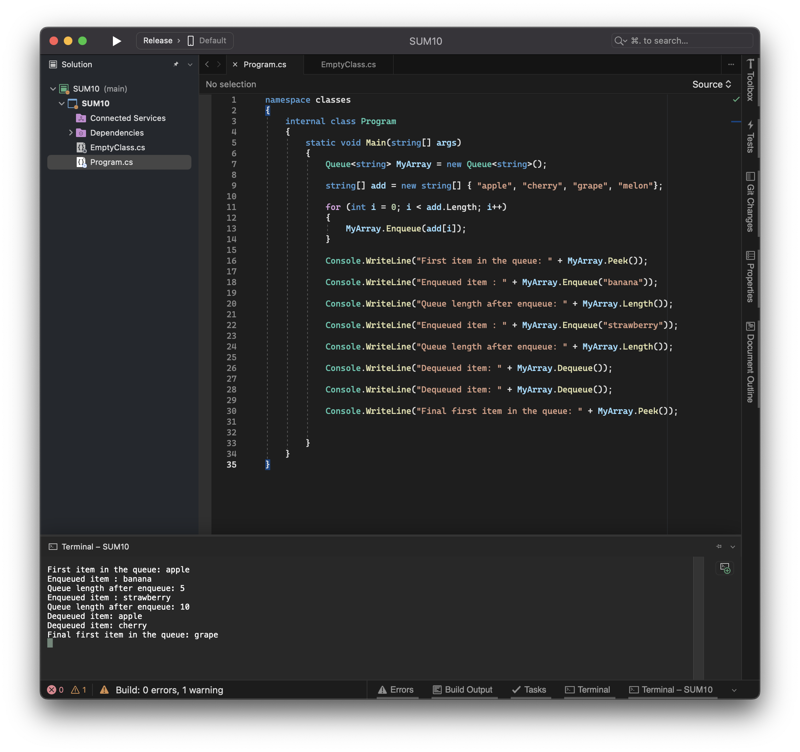

Key Concept - Be able to create a class with properties

Key Concept - Be able to create a generic/template class

Key Concept - Be able to use public and private access modifiers

## Semantics 

| Word | definition|
|---|---|
|Property|	a special sort of class member, intermediate in functionality between a field (or data member) and a method.|
|Generic class	Template class|encapsulate operations that are not specific to a particular data type.|
|access modifier|	specify the accessibility of the methods, classes, constructors, and other members of the class.|
|public member variable|publicly accessible variable that is associated with a specific object, and accessible for all its methods|
|private member variable|privately accessible variable that is associated with a specific object, and accessible for all its methods|
|public member method|publicly accessable operators and functions that are declared as members of a class. |
|private member method|privately accessible operators and functions that are declared as members of a class. |

	

## Reflection

In this section you should reflect upon what you have learnt. This is an important part of the learning process.
- What have you learnt from these exercises?

how to use classes in c#

- How can you apply what you have learnt?

in future programs in c#

- What new features of C# are you now able to use?

classes
