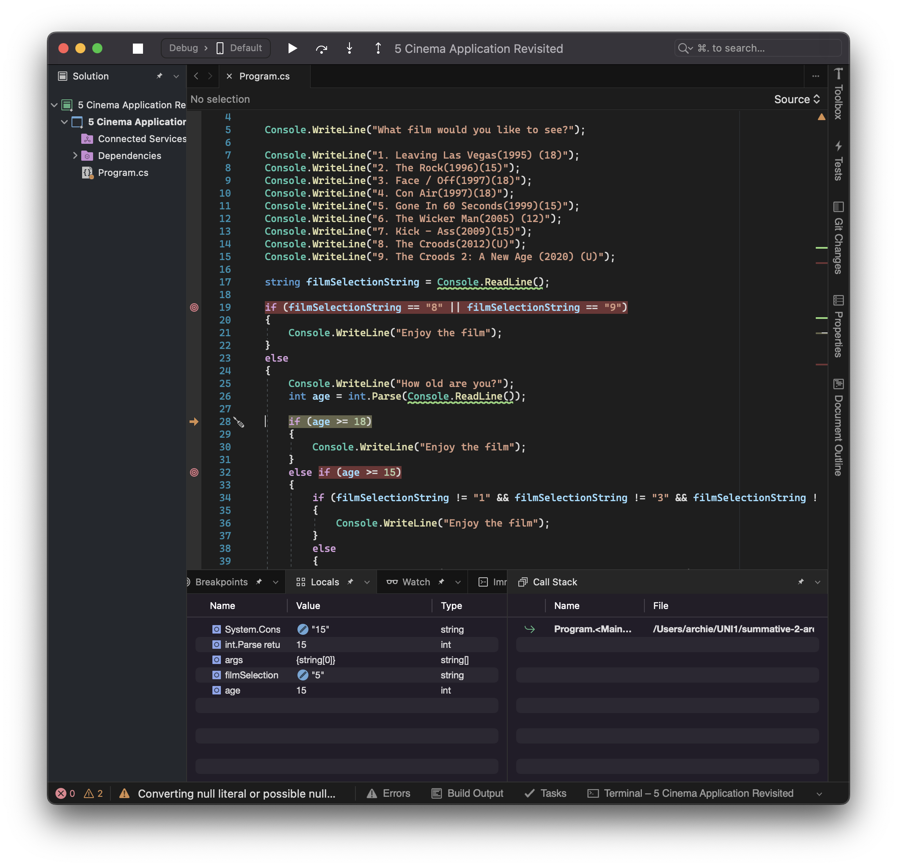

# Summative Assessment 2 - Making Decisions Using Conditionals

This assessment is summative - which means that you get feedback for completing this, and marks from this work count towards your final mark for this portfolio.

## ToDo List

- [ ] [:key: Demonstrate the use of Boolean types, and relational and logical operators.](#boolean)
- [ ] [:key: Demonstrate how a conditional statement is used to control the flow of execution of code.](#conditional-statements)
- [ ] [:key: Demonstrate an understanding of the order of evaluation of conditions in if – else if statements and nested conditional statements.](#nested-conditions)
- [ ] [:key: Demonstrate the use of debugging tools in Visual Studio.](#debugging)
- 
- [ ] [:speech_balloon: Express new semantics](#semantics)
- [ ] [:thought_balloon: Reflect on what you have learnt](#reflection)
- [ ] [:question: Request feedback (optional)](#requesting-feedback)
- [ ] :white_check_mark: Get your work checked off by a feedback engineer

## Boolean
Using the "Oldest Sibling" and "Pizza Shop" program provided - the use and functionality of Boolean operators can be explored.

The "if" statements at the end of the program are prime examples of how logical operators can be used to return a boolean true or false output, in order to dictate the flow of a program.

The results of testing can be seen below. with each test utilising different parameters in the if/elif/else statement at the end of the code.
| Test Number | Input | Output | 
|---|---|---|
|1| | "This application will tell us who the oldest of a pair of siblings is." | 
| | | "First sibling, what is your name?" |
| | "Mary" | "Hello Mary, How old are you?" |
| | "20"   | "Second sibling, what is your name?" | 
| | "Paul" | "Hello Paul, How old are you?" | 
| | "18"   | "Mary is 2 years older than Paul" | 
|2| | "This application will tell us who the oldest of a pair of siblings is." |
| | | "First sibling, what is your name?" | 
| | "Steve" | "Hello Steve, How old are you?" |
| | "21"   | "Second sibling, what is your name?" |
| | "Katie" | "Hello Katie, How old are you?" | 
| | "25"   | "Katie is 4 years older than Steve" | 
|3| | "This application will tell us who the oldest of a pair of siblings is." | 
| | | "First sibling, what is your name?" | 
| | "Ahmed" | "Hello Ahmed, How old are you?" | 
| | "23"   | "Second sibling, what is your name?" | 
| | "Peter" | "Hello Peter, How old are you?" | 
| | "23"   | "Ahmed and Peter are the same age" | 

```cs
Console.WriteLine("Welcome to the Oldest Sibling Application.");

Console.WriteLine("This application will tell us who the oldest of a pair of siblings is.");

Console.WriteLine("First sibling, what is your name?");

string name1 = Console.ReadLine();

Console.WriteLine("Hello " + name1 + ", How old are you?");

int age1 = int.Parse(Console.ReadLine());

Console.WriteLine("Second sibling, what is your name?");

string name2 = Console.ReadLine();

Console.WriteLine("Hello " + name2 + ", How old are you?");

int age2 = int.Parse(Console.ReadLine());

if (age1 > age2)
{
    Console.WriteLine(name1 + " is " + (age1 - age2) + " years older than " + name2);
}
else if (age1 < age2)
{
    Console.WriteLine(name2 + " is " + (age2 - age1) + " years older than " + name1);
}
else
{
    Console.WriteLine(name1 + " and " + name2 + " are the same age");
}
```

-------------------

| Test Number | Input | Expected Output | Actual Output | Pass/Fail |
|---|---|---|---|---|
|1| | "Welcome to the Pizza Shop Application!" |"Welcome to the Pizza Shop Application!" | ✅ |
| | | "What was the value of your order?"| "What was the value of your order?" |✅  |
| | "9" | "The total cost of your order is £11" | "The total cost of your order is £11"| ✅ |
|2| | "Welcome to the Pizza Shop Application!" |"Welcome to the Pizza Shop Application!" |✅  |
| | | "What was the value of your order?"| "What was the value of your order?" | ✅ |
| | "10" | "The total cost of your order is £10. You will get free delivery." |"The total cost of your order is £10. You will get free delivery."  | ✅ |
|3| | "Welcome to the Pizza Shop Application!" |"Welcome to the Pizza Shop Application!" | ✅ |
| | | "What was the value of your order?"| "What was the value of your order?" |✅  |
| | "14" | "The total cost of your order is £14. You will get free delivery." | "The total cost of your order is £14. You will get free delivery." | ✅ |
|4| | "Welcome to the Pizza Shop Application!" | "Welcome to the Pizza Shop Application!"|✅  |
| | |"What was the value of your order?" | "What was the value of your order?" | ✅  |
| | "15" | "The total cost of your order is £15. You will get free delivery and a free garlic bread!"| "The total cost of your order is £15. You will get free delivery and a free garlic bread!" |✅ |

```cs

Console.WriteLine("Welcome to the Pizza Shop Application!");

Console.WriteLine("What was the value of your order?");

int order = int.Parse(Console.ReadLine());

if (order > 14)
{
    Console.WriteLine("The total value of your order is £" + order + ".\n You will get free delivery and a free garlic bread.");
}
else if (order > 9)
{
    Console.WriteLine("The total value of your order is £" + order + ".\n You will get free delivery.");
}
else
{
    int neworder = order + 2;
    Console.WriteLine("The total value of your order is £" + neworder);
}
```

## Conditional Statements

Using the "Sensors" appliction -  the use of conditional statements and logic operators can be demonstrated. 

A table of conditional logic operators can be seen below, and are used to add more complexity and functionality to boolean logic statements, normally used to add multiple conditions to a single statements.

| Operator | Description | Examples | Result |
|---|---|---|---|
| && | **AND** - Evaluates to true if both the left hand operand is true | true && true | true |
| | and the right hand operand is true. | true && false | false |
| | Otherwise evalutes to false. | false && true | false |
| | | false && false | false |
| \| \| | **OR** - Evaluates to true if either the left hand operand is true, | true \|\| true | true |
| |  or the right hand operand is true, | true \|\| false | true |
| | or both are true. | false \|\| true | true |
| | Otherwise evaluates to false. | false \|\| false | false |
| ! | **NOT** - Only has one right hand operand (is a unary operator) | !true | false |
| | If the operand on the right hand side is true evaluates to false. | !false | true |
| | Otherwise evaluates to true. | | |

The results of program testing can be seen below as different parameters are changed in order to check the functionality of the if statements and the logic operators.

| Test Number | Input | Expected Output | Actual Output | Pass/Fail |
|---|---|---|---|---|
|1| | "Is the car in reverse? Press Y for yes or N for no." | "Is the car in reverse? Press Y for yes or N for no." | ✅ |
| | "Y" | "How much space is there behind the car?" | "How much space is there behind the car?" | ✅ |  
| | "1.49" | "beep. beep. beep" | "beep. beep. beep" | ✅ |
|2| | "Is the car in reverse? Press Y for yes or N for no." | "Is the car in reverse? Press Y for yes or N for no." | ✅ |
| | "Y" | "How much space is there behind the car?" | "How much space is there behind the car?" | ✅ |  
| | "1.51" | |  | ✅ |
|3| | "Is the car in reverse? Press Y for yes or N for no." | "Is the car in reverse? Press Y for yes or N for no." | ✅ |
| | "N" | "How much space is there behind the car?" | "How much space is there behind the car?" | ✅ |  
| | "1.49" | | | ✅ |
|4| | "Is the car in reverse? Press Y for yes or N for no." | "Is the car in reverse? Press Y for yes or N for no." | ✅ |
| | "N" | "How much space is there behind the car?" | "How much space is there behind the car?" | ✅ |  
| | "1.51" | | | ✅ |
|5| | "Is the car in reverse? Press Y for yes or N for no." | "Is the car in reverse? Press Y for yes or N for no." | ✅ |
| | "y" | "How much space is there behind the car?" | "How much space is there behind the car?" | ✅ |  
| | "1.49" | "beep. beep. beep" | "beep. beep. beep" | ✅ |
|6| | "Is the car in reverse? Press Y for yes or N for no." | "Is the car in reverse? Press Y for yes or N for no." | ✅ |
| | "y" | "How much space is there behind the car?" | "How much space is there behind the car?" | ✅ |  
| | "1.51" | | | ✅ |

```cs

Console.WriteLine("Parking Sensors Application");

Console.WriteLine("Is the car in reverse? Press Y for yes or N for no.");

string isInReverse = Console.ReadLine();

Console.WriteLine("How much space is there behind the car?");

float emptySpaceBehindCar = float.Parse(Console.ReadLine());

if ((isInReverse == "Y" || isInReverse == "y") && emptySpaceBehindCar <= 1.5f)
{
    Console.WriteLine("beep, beep, beep");
}
```


## Nested Conditions
Using the "Cinema Application" - the use of nested conditions can be demonstrated.

By using if tatements within if statements, the program can operate more efficiently by limiting the amount of repetition in the code.

| Test Number | Input | Output | 
|---|---|---|
|1| | "What film would you like to see?" | 
| | "1" | "How old are you?" | 
| | "14" | "You have selected The Rock " | 
| | "You are not old enough to see this film" | 
|2| | "What film would you like to see?" | 
| | "1" | "How old are you?" | 
| | "15" | "You have selected The Rock " | 
| | | "Enjoy the film" | 
|3| | "What film would you like to see?" | 
| | "2" | "How old are you?" | 
| | "17" | "You have selected Face / Off" | 
| | | "You are not old enough to see this film" | 
|4| | "What film would you like to see?" | 
| | "2" | "How old are you?" | 
| | "18" | "You have selected Face / Off" | 
| | | "Enjoy the film" | 
|5| |  "What film would you like to see?" | 
| | "4" | "How old are you?" | 
| | "11" | "You have selected The Wicker Man" | 
| | | "You are not old enough to see this film" | 
|6| | "What film would you like to see?" | 
| | "4" | "How old are you?" | 
| | "12" | "You have selected The Wicker Man" |
| | | "Enjoy the film" | 
|7| | "What film would you like to see?" | 
| | "4" | "How old are you?" | 
| | "1" | "You have selected The Croods" | 
| | | "Enjoy the film" | 
|8| | "What film would you like to see?" | 
| | "4" | "How old are you?" | 
| | "15" | "You have selected The Croods" | 
| | | "Enjoy the film" | 
```cs
Console.WriteLine("Welcome to the AMAZING Nicorama Cage-athon!");
Console.WriteLine("A celebration of 30 years of Nic Cage.");

Console.WriteLine("1. The Rock(1996)(15)");
Console.WriteLine("2. Face / Off(1997)(18)");
Console.WriteLine("3. The Wicker Man(2005) (12)");
Console.WriteLine("4. The Croods(2012)(U)");

Console.WriteLine("What film would you like to see?");

string filmSelectionString = Console.ReadLine();

if (filmSelectionString == "4")
{
    Console.WriteLine("Enjoy the film");
}
else
{
    Console.WriteLine("How old are you?");
    int age = int.Parse(Console.ReadLine());
    if (age >= 18)
    {
        Console.WriteLine("Enjoy the film");
    }
    else if (age >= 15)
    {
        if (filmSelectionString != "2")
        {
            Console.WriteLine("Enjoy the film");
        }
        else
        {
            Console.WriteLine("You are not old enough to see this film");
        }
    }
    else if (age >= 12)
    {
        if (filmSelectionString == "3")
        {
            Console.WriteLine("Enjoy the film");
        }
        else
        {
            Console.WriteLine("You are not old enough to see this film");
        }
    }
    else
    {
        Console.WriteLine("You are not old enough to see this film");
    }
}
```


## Debugging

Using the "Cinema Application Revisited" - debugging can be used.

Breaks can be made in the code (represented by red cirlces in the grey margin), and in a break, the values stored in each variable and be viewed and adjusted, and then step overs can be used to progress through the code line by line.



| Test Number | Input | Output | 
|---|---|---|
|1| | "What film would you like to see?" | 
| | "1" | "How old are you?" |
| | "17" | "You are not old enough to see this film" |
|2| | "What film would you like to see?" |
| | "1" | "How old are you?" |
| | "18" | "Enjoy the film" |
|3| | "What film would you like to see?" | 
| | "5" | "How old are you?" |  
| | "14" | "You are not old enough to see this film"  | 
|4| | "What film would you like to see?" | 
| | "5" | "How old are you?" |  
| | "16" | "Enjoy the film" | 
|5| | "What film would you like to see?" | 
| | "6" | "How old are you?" | 
| | "10" | "You are not old enough to see this film"  | 
|6| | "What film would you like to see?" |
| | "6" | "How old are you?" |
| | "17" | "Enjoy the film" | 

```cs
Console.WriteLine("Welcome to the AMAZING Nicorama Cage-athon!");
Console.WriteLine("A celebration of 30 years of Nic Cage.");

Console.WriteLine("What film would you like to see?");

Console.WriteLine("1. Leaving Las Vegas(1995) (18)");
Console.WriteLine("2. The Rock(1996)(15)");
Console.WriteLine("3. Face / Off(1997)(18)");
Console.WriteLine("4. Con Air(1997)(18)");
Console.WriteLine("5. Gone In 60 Seconds(1999)(15)");
Console.WriteLine("6. The Wicker Man(2005) (12)");
Console.WriteLine("7. Kick - Ass(2009)(15)");
Console.WriteLine("8. The Croods(2012)(U)");
Console.WriteLine("9. The Croods 2: A New Age (2020) (U)");

string filmSelectionString = Console.ReadLine();

if (filmSelectionString == "8" || filmSelectionString == "9")
{
    Console.WriteLine("Enjoy the film");
}
else
{
    Console.WriteLine("How old are you?");
    int age = int.Parse(Console.ReadLine());

    if (age >= 18)
    {
        Console.WriteLine("Enjoy the film");
    }
    else if (age >= 15)
    {
        if (filmSelectionString != "1" && filmSelectionString != "3" && filmSelectionString != "4")
        {
            Console.WriteLine("Enjoy the film");
        }
        else
        {
            Console.WriteLine("You are not old enough to see this film");
        }
    }
    else if (age >= 12)
    {
        if (filmSelectionString == "6")
        {
            Console.WriteLine("Enjoy the film");
        }
        else
        {
            Console.WriteLine("You are not old enough to see this film");
        }
    }
    else
    {
        Console.WriteLine("You are not old enough to see this film");
    }
}
```


## Requesting Feedback

This section is optional, but encouraged. Feedback is crucial to the learning process. If you have any questions about what you have learnt this week record them here for your demonstrator to answer. **Replace** the bullet points below with any questions you might have.
- Why are we here?
- What is the meaning of life?

## Semantics

In order to talk about programming we need to establish a set of core terminology, or "semantics". In this context "semantics" means the words we use to talk about programming. This is different to Syntax, which is what we type to tell the computer what we want it do to. It is important that when we use words that have
a special meaning in the context of programming we share a common understanding.

Complete this table of semantics with your understanding of what these terms mean:

| Word | Synonyms | Meaning |
|---|---|---|
|Boolean|logic|true or false|
|Condition|parameter| phrase used to determine true or false |
|Code Block| code sectoin | a group of declarations and statements that operates as a unit|
|Scope| work area| the area in which a code block operates|
|Relational Operator| comparison operator | compares two values|
|Logical Operator| binary operator | compares true or false |
|Break Point| pause point| a point that can pause/stop the running od code |
|Step Through| resume points | skip past the break point to continue witht he code|
|Nested Condition| if elif else | an operator that provides multiple paths with specific condtions(if within an if) |


## Reflection
In this section you should reflect upon what you have learnt. This is an important part of the learning process.
- What have you learnt from these exercises?

how to debug code
- How can you apply what you have learnt?

in future projects
- What new features of C# are you now able to use?

logical operators and debugging
