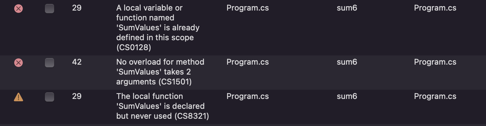

# 441101-2223-Summative-6

:key: Give examples of when you have called a method that already exists.

:key: Demonstrate how to write and call a method, and how to pass data into a method and get data out of a method.

:key: Demonstrate how to use methods to increase readability and reduce scope.

:key: Demonstrate the use of optional parameters and method overloading.

## Calling and Passing Methods

```cs
void SayHello()
{
    Console.WriteLine("Hello, World!");
}

void SayHelloWithName(string pName)
{
    Console.WriteLine($"Hello, {pName}");
}

string GetName()
{
    Console.WriteLine("What is your name?");
    string name = Console.ReadLine();
    return name;
}

string name = GetName()

SayHelloWithName(name)

```

```console
What is your name?
archie
Hello, archie
```


## Using Methods to Increase Readability and Reduce Scope
Using methods can turn code from looking like this :

 
 
 
To this:

 
 
This means that the scope of the code is only operating from one line instead of having it run though of all each line chronologically.
This makes code easier to read, easier to debug and easier to reuse.

## Optional Parameters and Method Overloading

Assigning one of the parameters to a value when creating a method results in that value being the default if no value is entered when the method is called.
```cs
void MessageRepeater(string pMessage, int pRepetitions = 1)
{
  for(int i = 1; i <= pRepetitions; i++)
  {
    Console.WriteLine($"{i}. {pMessage}");
  }
}
```

I found three different methods for creating a Sum method for an array, be that a for loop, a foreach loop or suing the .Sum function already in place (which feels like cheating).

```cs
int SumValues(int[] pArray)
{
    int total = 0;

    //int total = pArray.Sum();

    //for (int i = 0; i <= pArray.Length; i++)
    //{
    //    total += pArray[i];
    //}

    foreach (int item in pArray)
    {
        total += item;
    }

    return total;
}

int[] numbers = { 10, 2, 5, 7, 13, 8, 4 };

int sum = SumValues(numbers);

Console.WriteLine(sum);
```

```console
49
```
I was unable to successfully created an overloading method, however I still feel like I understand the principels behind them.

```cs
int SumValues(int[] pArray)
{
    //int total = pArray.Sum();

    //int total = 0

    //for (int i = 0; i <= pArray.Length; i++)
    //{
    //    total += pArray[i];
    //}

    int total = 0;

    foreach (int item in pArray)
    {
        total += item;
    }

    return total;
}


int SumValues(int pOne = 0, int pTwo = 0, int pThree = 0, int pFour = 0, int pFive = 0)
{
    int total = (pOne + pTwo + pThree + pFour + pFive);
    return total;

}
int[] numbers = { 10, 2, 5, 7, 13, 8, 4 };

int sum = SumValues(numbers);

Console.WriteLine(sum);

sum = SumValues(13, 27);

Console.WriteLine(sum);
```
These were the error messages displayed


## Semantics
 
| Word | Synonyms | Meaning |
|---|---|---|
|Method Signature|method name |the name of the method |
|Parameter|variable | the variables within the method |
|Argument|input | the data passed into the parameters |
|Return type|data output | the data type outputted by a method |
|Method Call|method use | when a method is implaneted and used within the code |
|Method Scope|method work area | the area of memory in which the method can access other data |
|Overloaded Method|stacked method |two methods with the same name that can be called and used differnetly depending on the argument |
|Optional Parameter|additional parameter |a parameter assigned with a default value that doesnt necissarily need to be called |
|Refactor|adjust | changing code without changing its functionailty|

